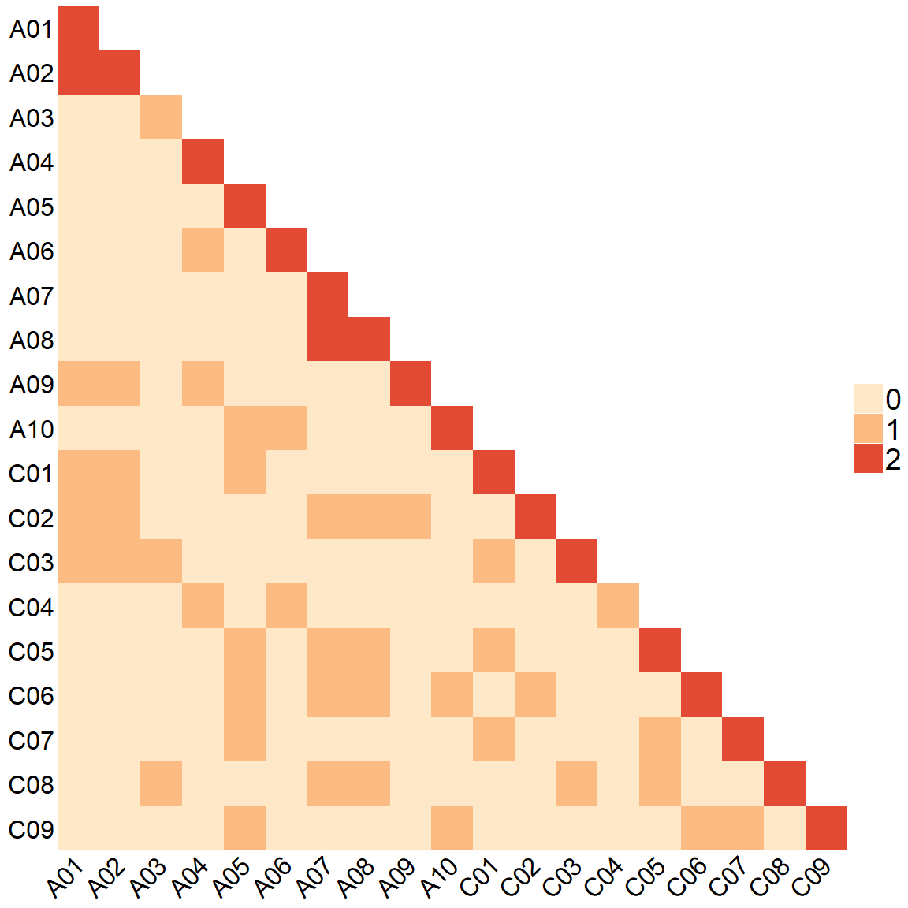

# Chrosome pairs in communities

- [Load data](#load-data)

``` r
library(dplyr)
```


    Attaching package: 'dplyr'

    The following objects are masked from 'package:stats':

        filter, lag

    The following objects are masked from 'package:base':

        intersect, setdiff, setequal, union

``` r
library(purrr)
library(tidyr)
#library(pheatmap)
library(ComplexHeatmap)
```

    Loading required package: grid

    ========================================
    ComplexHeatmap version 2.18.0
    Bioconductor page: http://bioconductor.org/packages/ComplexHeatmap/
    Github page: https://github.com/jokergoo/ComplexHeatmap
    Documentation: http://jokergoo.github.io/ComplexHeatmap-reference

    If you use it in published research, please cite either one:
    - Gu, Z. Complex Heatmap Visualization. iMeta 2022.
    - Gu, Z. Complex heatmaps reveal patterns and correlations in multidimensional 
        genomic data. Bioinformatics 2016.


    The new InteractiveComplexHeatmap package can directly export static 
    complex heatmaps into an interactive Shiny app with zero effort. Have a try!

    This message can be suppressed by:
      suppressPackageStartupMessages(library(ComplexHeatmap))
    ========================================

``` r
library(circlize)
```

    ========================================
    circlize version 0.4.15
    CRAN page: https://cran.r-project.org/package=circlize
    Github page: https://github.com/jokergoo/circlize
    Documentation: https://jokergoo.github.io/circlize_book/book/

    If you use it in published research, please cite:
    Gu, Z. circlize implements and enhances circular visualization
      in R. Bioinformatics 2014.

    This message can be suppressed by:
      suppressPackageStartupMessages(library(circlize))
    ========================================

## Load data

``` r
comm <- read.delim2("data/community_segments.tsv")
# remove the random ones
comm2 <- comm %>%
  filter(
    !grepl("Random", chromosome, ignore.case = TRUE),
    !grepl("^R", chromosome)
  )
```

``` r
# df must have: community_id, chromosome, bp_length
chrom_cooccurrence <- function(df) {
  # 1) Aggregate per community × chromosome
  df_comm_chr <- df %>%
    group_by(community_id, chromosome) %>%
    summarise(bp = sum(bp_length), .groups = "drop")
  
  # All chromosomes
  chroms <- sort(unique(df_comm_chr$chromosome))
  n_chr  <- length(chroms)
  
  # 2) Initialise matrices
  cooc_unweighted <- matrix(
    0, nrow = n_chr, ncol = n_chr,
    dimnames = list(chroms, chroms)
  )
  
  cooc_weighted <- matrix(
    0, nrow = n_chr, ncol = n_chr,
    dimnames = list(chroms, chroms)
  )
  
  # 3) Loop over communities
  comm_ids <- unique(df_comm_chr$community_id)
  
  for (comm in comm_ids) {
    sub <- df_comm_chr[df_comm_chr$community_id == comm, ]
    
    # Only keep unique chromosomes in this community
    # with their total bp
    sub <- sub %>%
      arrange(chromosome)
    
    if (nrow(sub) < 2L) next  # need at least two chromosomes to "mix"
    
    # Indices of chromosomes in the global vector
    idx <- match(sub$chromosome, chroms)
    
    # All unordered pairs (i < j)
    pairs <- t(combn(seq_along(idx), 2))
    
    # Unweighted: +1 for each pair (community counts)
    for (k in seq_len(nrow(pairs))) {
      i_local <- pairs[k, 1]
      j_local <- pairs[k, 2]
      
      i <- idx[i_local]
      j <- idx[j_local]
      
      # Unweighted: just "this community has i & j"
      cooc_unweighted[i, j] <- cooc_unweighted[i, j] + 1
      cooc_unweighted[j, i] <- cooc_unweighted[j, i] + 1
      
      # Weighted: add min(bp_i, bp_j) for this community
      bp_i <- sub$bp[i_local]
      bp_j <- sub$bp[j_local]
      w    <- min(bp_i, bp_j)
      
      cooc_weighted[i, j] <- cooc_weighted[i, j] + w
      cooc_weighted[j, i] <- cooc_weighted[j, i] + w
    }
  }
  
  # 4) Diagonal (optional)
  # Unweighted diagonal = number of communities where each chromosome appears
  # Weighted diagonal   = total bp of each chromosome
  chr_communities <- df_comm_chr %>%
    group_by(chromosome) %>%
    summarise(n_comm = n_distinct(community_id),
              total_bp = sum(bp), .groups = "drop")
  
  idx_diag <- match(chr_communities$chromosome, chroms)
  cooc_unweighted[cbind(idx_diag, idx_diag)] <- chr_communities$n_comm
  cooc_weighted[cbind(idx_diag, idx_diag)]   <- chr_communities$total_bp
  
  list(
    unweighted = cooc_unweighted,
    weighted   = cooc_weighted,
    chrom_summary = chr_communities
  )
}

# Run the function
res <- chrom_cooccurrence(comm2)

# Unweighted co-occurrence matrix:
res$unweighted
```

        A01 A02 A03 A04 A05 A06 A07 A08 A09 A10 C01 C02 C03 C04 C05 C06 C07 C08 C09
    A01   2   2   0   0   0   0   0   0   1   0   1   1   1   0   0   0   0   0   0
    A02   2   2   0   0   0   0   0   0   1   0   1   1   1   0   0   0   0   0   0
    A03   0   0   1   0   0   0   0   0   0   0   0   0   1   0   0   0   0   1   0
    A04   0   0   0   2   0   1   0   0   1   0   0   0   0   1   0   0   0   0   0
    A05   0   0   0   0   2   0   0   0   0   1   1   0   0   0   1   1   1   0   1
    A06   0   0   0   1   0   2   0   0   0   1   0   0   0   1   0   0   0   0   0
    A07   0   0   0   0   0   0   2   2   0   0   0   1   0   0   1   1   0   1   0
    A08   0   0   0   0   0   0   2   2   0   0   0   1   0   0   1   1   0   1   0
    A09   1   1   0   1   0   0   0   0   2   0   0   1   0   0   0   0   0   0   0
    A10   0   0   0   0   1   1   0   0   0   2   0   0   0   0   0   1   0   0   1
    C01   1   1   0   0   1   0   0   0   0   0   2   0   1   0   1   0   1   0   0
    C02   1   1   0   0   0   0   1   1   1   0   0   2   0   0   0   1   0   0   0
    C03   1   1   1   0   0   0   0   0   0   0   1   0   2   0   0   0   0   1   0
    C04   0   0   0   1   0   1   0   0   0   0   0   0   0   1   0   0   0   0   0
    C05   0   0   0   0   1   0   1   1   0   0   1   0   0   0   2   0   1   1   0
    C06   0   0   0   0   1   0   1   1   0   1   0   1   0   0   0   2   0   0   1
    C07   0   0   0   0   1   0   0   0   0   0   1   0   0   0   1   0   2   0   1
    C08   0   0   1   0   0   0   1   1   0   0   0   0   1   0   1   0   0   2   0
    C09   0   0   0   0   1   0   0   0   0   1   0   0   0   0   0   1   1   0   2

``` r
# Weighted (bp-based) co-occurrence matrix:
res$weighted
```

              A01       A02       A03       A04       A05       A06       A07
    A01 554895683  86809179         0         0         0         0         0
    A02  86809179 564248280         0         0         0         0         0
    A03         0         0 671663208         0         0         0         0
    A04         0         0         0 414900112         0  71841889         0
    A05         0         0         0         0 604846305         0         0
    A06         0         0         0  71841889         0 723727772         0
    A07         0         0         0         0         0         0 486833268
    A08         0         0         0         0         0         0  66576392
    A09  38840263  66412396         0  69545683         0         0         0
    A10         0         0         0         0  26714907  60465182         0
    C01 516055420  47968916         0         0  59361666         0         0
    C02  38840263 516279364         0         0         0         0  56258359
    C03  57185290  47968916 671663208         0         0         0         0
    C04         0         0         0 345354429         0  71841889         0
    C05         0         0         0         0 578131398         0  30146539
    C06         0         0         0         0  26714907         0 456686729
    C07         0         0         0         0  47115293         0         0
    C08         0         0  79204209         0         0         0  30146539
    C09         0         0         0         0  26714907         0         0
              A08       A09       A10       C01       C02        C03        C04
    A01         0  38840263         0 516055420  38840263   57185290          0
    A02         0  66412396         0  47968916 516279364   47968916          0
    A03         0         0         0         0         0  671663208          0
    A04         0  69545683         0         0         0          0  345354429
    A05         0         0  26714907  59361666         0          0          0
    A06         0         0  60465182         0         0          0   71841889
    A07  66576392         0         0         0  56258359          0          0
    A08 436195205         0         0         0  36429853          0          0
    A09         0 979149407         0         0  66412396          0          0
    A10         0         0 410051760         0         0          0          0
    C01         0         0         0 821783646         0   57185290          0
    C02  36429853  66412396         0         0 969323139          0          0
    C03         0         0         0  57185290         0 1179729806          0
    C04         0         0         0         0         0          0 1028683641
    C05  54716376         0         0  59361666         0          0          0
    C06  36429853         0  68551219         0  56258359          0          0
    C07         0         0         0  47115293         0          0          0
    C08 399765352         0         0         0         0   79204209          0
    C09         0         0 349586578         0         0          0          0
              C05       C06       C07       C08        C09
    A01         0         0         0         0          0
    A02         0         0         0         0          0
    A03         0         0         0  79204209          0
    A04         0         0         0         0          0
    A05 578131398  26714907  47115293         0   26714907
    A06         0         0         0         0          0
    A07  30146539 456686729         0  30146539          0
    A08  54716376  36429853         0 399765352          0
    A09         0         0         0         0          0
    A10         0  68551219         0         0  349586578
    C01  59361666         0  47115293         0          0
    C02         0  56258359         0         0          0
    C03         0         0         0  79204209          0
    C04         0         0         0         0          0
    C05 908241236         0  47115293  54716376          0
    C06         0 823681759         0         0   68551219
    C07  47115293         0 916986677         0   61807080
    C08  54716376         0         0 845867071          0
    C09         0  68551219  61807080         0 1001249470

``` r
# Per-chromosome summary (how many communities, total bp, etc.):
res$chrom_summary
```

    # A tibble: 19 × 3
       chromosome n_comm   total_bp
       <chr>       <int>      <int>
     1 A01             2  554895683
     2 A02             2  564248280
     3 A03             1  671663208
     4 A04             2  414900112
     5 A05             2  604846305
     6 A06             2  723727772
     7 A07             2  486833268
     8 A08             2  436195205
     9 A09             2  979149407
    10 A10             2  410051760
    11 C01             2  821783646
    12 C02             2  969323139
    13 C03             2 1179729806
    14 C04             1 1028683641
    15 C05             2  908241236
    16 C06             2  823681759
    17 C07             2  916986677
    18 C08             2  845867071
    19 C09             2 1001249470

``` r
# Matrix: weighted or unweighted
mat <- res$unweighted  # or res$unweighted

mat <- res$unweighted
vals <- sort(unique(as.vector(mat)))

# discrete palette
# my recommended palette: magma or inferno
pal <- colorRampPalette(c("#fee8c8", "#fdbb84", "#e34a33"))(length(vals))
names(pal) <- vals  # map value -> color

# mask lower-triangle including diagonal (NA hides cells)
mat_mask <- mat
mat_mask[upper.tri(mat_mask, diag = TRUE)] <- NA
Heatmap(
  mat_mask,
  col = pal,
  na_col = "white",
  cluster_rows = FALSE,
  cluster_columns = FALSE,

  # LABELS
  row_names_side = "left",
  row_names_rot = 0,
  row_names_gp = gpar(fontsize = 24),

  column_names_side = "bottom",
  column_names_rot = 45,
  column_names_gp = gpar(fontsize = 24),

  # LEGEND
  heatmap_legend_param = list(
    at = vals,
    labels = vals,
    title = "",
    labels_gp = gpar(fontsize = 28),
    title_gp  = gpar(fontsize = 20, fontface = "bold"),
    # size legend squares
    grid_width  = unit(10, "mm"),
    grid_height = unit(10, "mm")
  ),

  name = "mix"
)
```



  
  
