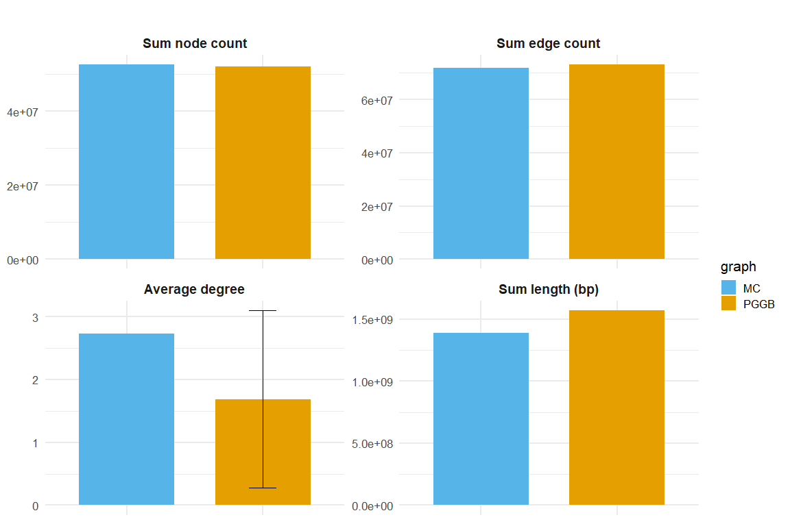

# Degree connected

``` r
library(dplyr)
```


    Attaching package: 'dplyr'

    The following objects are masked from 'package:stats':

        filter, lag

    The following objects are masked from 'package:base':

        intersect, setdiff, setequal, union

``` r
library(tidyr)
library(ggplot2)
```

    Warning: package 'ggplot2' was built under R version 4.3.3

``` r
pggb <- read.table(
  "data/degrees_pggb.tsv",
  header = TRUE,
  check.names = FALSE
)

mc <- read.table(
  "data/degrees_mc.tsv",
  header = TRUE,
  check.names = FALSE
)
```

    Warning in read.table("data/degrees_mc.tsv", header = TRUE, check.names =
    FALSE): incomplete final line found by readTableHeader on 'data/degrees_mc.tsv'

``` r
# Add graph labels
pggb$graph <- "PGGB"
mc$graph   <- "MC"

deg_all <- bind_rows(pggb, mc)
todrop = c("max.degree", "min.degree")
deg_all <- deg_all[, !(names(deg_all) %in% todrop)]

summary_df <- deg_all %>%
  group_by(graph) %>%
  summarise(
    node.count_mean = sum(node.count),
    #node.count_sd   = ifelse(n() > 1, sd(node.count), NA_real_),
    edge.count_mean = sum(edge.count),
    #edge.count_sd   = ifelse(n() > 1, sd(edge.count), NA_real_),
    avg.degree_mean = mean(avg.degree),
    avg.degree_sd   = ifelse(n() > 1, sd(avg.degree), NA_real_),
    .groups = "drop"
  )

summary_df
```

    # A tibble: 2 × 5
      graph node.count_mean edge.count_mean avg.degree_mean avg.degree_sd
      <chr>           <int>           <int>           <dbl>         <dbl>
    1 MC           52682814        72020839            2.73         NA   
    2 PGGB         52082662        73221067            1.69          1.41

``` r
tot_len <- c(1385535886,1569067859)
summary_df$length_mean <- tot_len
summary_df$length_sd   <- NA   # MC has 1 value; PGGB gets NA unless you add SD


# Now pivot_longer works correctly
long_df <- summary_df %>%
  pivot_longer(
    cols = -graph,
    names_to = c("metric", ".value"),
    names_pattern = "(.*)_(mean|sd)"
  ) %>%
  mutate(
    metric = factor(metric,
      levels = c("node.count", "edge.count", "avg.degree", "length"),
      labels = c("Sum node count", "Sum edge count", "Average degree", "Sum length (bp)" )
    )
  ) %>%
  drop_na(metric)
  

long_df
```

    # A tibble: 8 × 4
      graph metric                   mean    sd
      <chr> <fct>                   <dbl> <dbl>
    1 MC    Sum node count    52682814    NA   
    2 MC    Sum edge count    72020839    NA   
    3 MC    Average degree           2.73 NA   
    4 MC    Sum length (bp) 1385535886    NA   
    5 PGGB  Sum node count    52082662    NA   
    6 PGGB  Sum edge count    73221067    NA   
    7 PGGB  Average degree           1.69  1.41
    8 PGGB  Sum length (bp) 1569067859    NA   

``` r
cols <- c("PGGB" = "#E69F00", "MC" = "#56B4E9")

ggplot(long_df, aes(x = graph, y = mean, fill = graph)) +
  geom_col(width = 0.7) +
  geom_errorbar(
    aes(ymin = mean - sd, ymax = mean + sd),
    width = 0.2,
    data = subset(long_df, !is.na(sd))  # only PGGB gets error bars
  ) +
  facet_wrap(. ~ metric, scales = "free_y") +
  scale_fill_manual(values = cols) +
  theme_minimal(base_size = 16) +
  theme(
    strip.text   = element_text(size = 14, face = "bold"),
    axis.title.x = element_blank(),
    #axis.text.x  = element_text(face = "bold"),
    plot.title   = element_text(size = 18, face = "bold", hjust = 0.5),
    axis.text.x=element_blank()
  ) +
  labs(
    y = NULL,
    title = ""
  )
```



  
