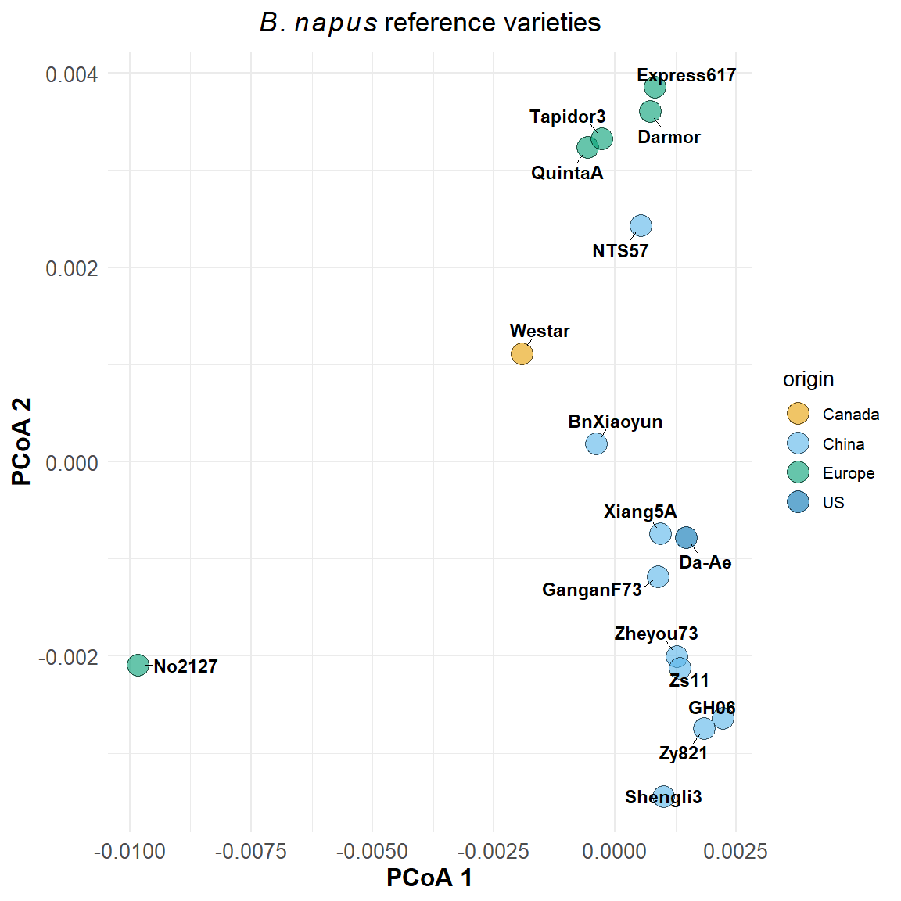

# Distances_genomes

- [Plot distances](#plot-distances)

``` r
# Install packages once if needed:
# install.packages(c("ape", "ggplot2", "ggrepel"))

library(ape)
```

    Warning: package 'ape' was built under R version 4.3.3

``` r
library(ggplot2)
```

    Warning: package 'ggplot2' was built under R version 4.3.3

``` r
library(ggrepel)
```

## Plot distances

``` r
# 1. Read the distance matrix
dist_mat <- read.table(
  "data/bnaipus16_distances.tab",
  header = TRUE,
  row.names = 1,
  check.names = FALSE
)

labs <- read.table("data/Varieties_bnapus.csv", 
                  header = TRUE,
                  check.names = FALSE,
                  sep = ','
)

# 2. Make sure column names match row names (same order)
colnames(dist_mat) <- rownames(dist_mat)

# OPTIONAL: check it’s symmetric
all(rownames(dist_mat) == colnames(dist_mat))
```

    [1] TRUE

``` r
# 3. Run PCoA (ape::pcoa)
dist_obj <- as.dist(dist_mat)
pcoa_res <- pcoa(dist_obj)

# 4. Build a data frame for plotting
pcoa_df <- as.data.frame(pcoa_res$vectors[, 1:2])
pcoa_df$variety <- rownames(pcoa_df)

pcoa_df <- merge(pcoa_df, labs, by.x = "variety", by.y = "var")

scale_fill_manual(values = c(
  "#E69F00", "#56B4E9", "#009E73", "#0072B2"
))
```

    <ggproto object: Class ScaleDiscrete, Scale, gg>
        aesthetics: fill
        axis_order: function
        break_info: function
        break_positions: function
        breaks: waiver
        call: call
        clone: function
        dimension: function
        drop: TRUE
        expand: waiver
        get_breaks: function
        get_breaks_minor: function
        get_labels: function
        get_limits: function
        get_transformation: function
        guide: legend
        is_discrete: function
        is_empty: function
        labels: waiver
        limits: NULL
        make_sec_title: function
        make_title: function
        map: function
        map_df: function
        n.breaks.cache: NULL
        na.translate: TRUE
        na.value: grey50
        name: waiver
        palette: function
        palette.cache: NULL
        position: left
        range: environment
        rescale: function
        reset: function
        train: function
        train_df: function
        transform: function
        transform_df: function
        super:  <ggproto object: Class ScaleDiscrete, Scale, gg>

``` r
# 5. Plot with ggplot
ggplot(pcoa_df, aes(x = Axis.1, y = Axis.2, label = variety, fill = origin)) +
  
  # Draw large filled points with outline
  geom_point(size = 10, shape = 21, color = "black", alpha = 0.6) +
  
  geom_text_repel(
    size = 6, 
    fontface = "bold",
    box.padding = 1.0,
    point.padding = 0.8,
    min.segment.length = 0,
    max.overlaps = Inf
  ) +

  theme_minimal(base_size = 20) +
  scale_fill_manual(values = c(
  "#E69F00", "#56B4E9", "#009E73", "#0072B2")) +
  theme(
    axis.title = element_text(size = 24, face = "bold"),
    axis.text = element_text(size = 20),
    plot.title = element_text(size = 26, face = "bold", hjust = 0.5)
  ) +
  labs(
    x = "PCoA 1",
    y = "PCoA 2",
    title = bquote(italic(B.~napus) ~ "reference varieties")
  )
```



``` r
# 6. Save the plot to a file (so you can open it)
#ggsave("bnapus_pcoa.png", plot = p, width = 6, height = 5, dpi = 300)
```
