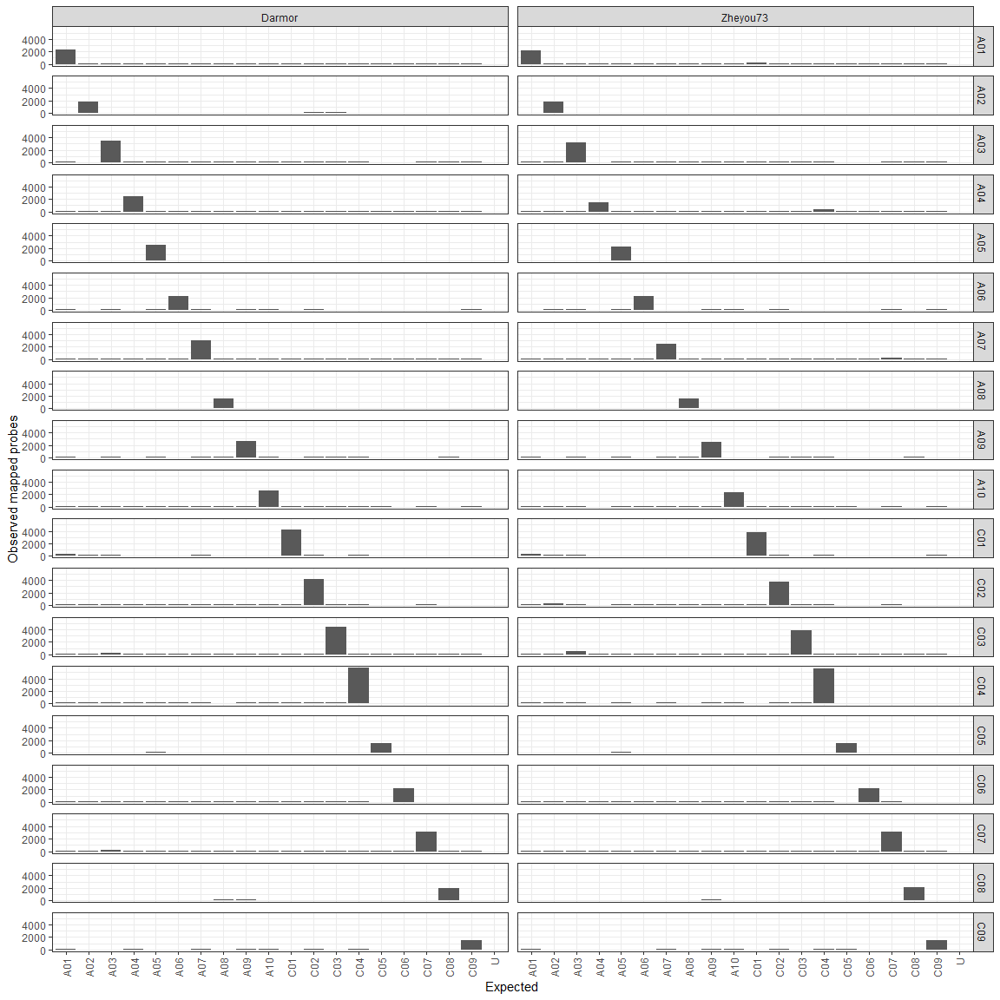
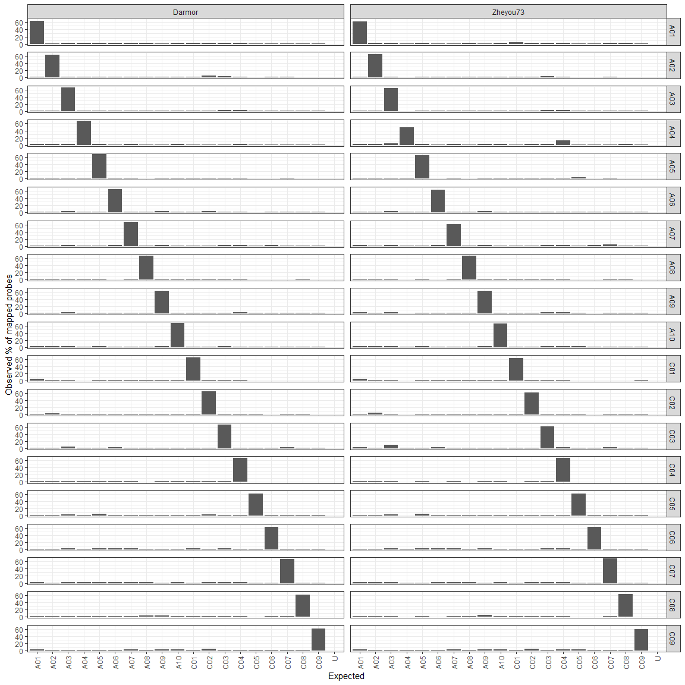

# Probes-mapping

- [Libraries](#libraries)
- [Load data](#load-data)
- [Plot expected mapping per
  variety](#plot-expected-mapping-per-variety)

## Libraries

``` r
library(dplyr)
```


    Attaching package: 'dplyr'

    The following objects are masked from 'package:stats':

        filter, lag

    The following objects are masked from 'package:base':

        intersect, setdiff, setequal, union

``` r
library(stringr)
library(readr)
```

    Warning: package 'readr' was built under R version 4.3.3

``` r
library(purrr)
library(ggplot2)
```

    Warning: package 'ggplot2' was built under R version 4.3.3

## Load data

``` r
# ---- settings ----
dataPath <- "data/probes"   # folder that contains: bnapus_C07.sorted.idxstats.txt, ...
outFile  <- file.path(dataPath, "bnapus_all_idxstats_merged.tsv")

allFiles <- list.files(
  path       = dataPath,
  pattern    = "^bnapus_[^_]+_[AC]\\d+\\.sorted\\.idxstats\\.txt.gz$",
  full.names = TRUE
)

# ---- load & merge ----
# samtools idxstats format is typically:
#   reference  length  mapped  unmapped
# but headers are not present, so we assign them.
merged_idxstats <- map_dfr(allFiles, function(fn) {

  d <- read_tsv(
    fn,
    col_names = c("reference", "length", "mapped", "unmapped"),
    show_col_types = FALSE
  )

  d %>%
    mutate(
      fileName = fn
    )
})

# ---- extract expected chromosome from filename ----
file_base <- basename(merged_idxstats$fileName)

# Extract e.g. "C07" / "C08" from "bnapus_C07.sorted.idxstats.txt"
merged_idxstats$expected_chromosome <- str_match(
  file_base,
  "^bnapus_[^_]+_([AC]\\d+)\\.sorted\\.idxstats\\.txt.gz$"
)[, 2]

merged_idxstats$variety <- str_match(
  file_base,
  "^bnapus_([^_]+)_[AC]\\d+\\.sorted\\.idxstats\\.txt.gz$"
)[, 2]

# Optional: reorder columns nicely
merged_idxstats <- merged_idxstats %>%
  select(expected_chromosome, variety, reference, length, mapped, unmapped, fileName)
```

## Plot expected mapping per variety

``` r
df2 <- merged_idxstats %>%
  # remove scaffold rows
  filter(!str_detect(reference, regex("scaffold", ignore_case = TRUE))) %>%
  # rename '*' reference to 'unmapped'
  mutate(reference = if_else(reference == "*", "U", reference)) %>%
  # make sure numeric columns are numeric
  mutate(
    length   = as.numeric(length),
    mapped   = as.numeric(mapped),
    unmapped = as.numeric(unmapped)
  ) %>%
  mutate(
    reference_chr = str_extract(reference, "[^#]+$")
  )

# plot: mapped reads per reference
p <- df2 %>%
  ggplot(aes(x = reference_chr, y = mapped)) +
  geom_col() +
  facet_grid(expected_chromosome ~ variety, scales = "free_x", space = "free_x") +
  theme_bw() +
  theme(
    axis.text.x = element_text(angle = 90, vjust = 0.5, hjust = 1),
    panel.spacing = unit(0.6, "lines")
  ) +
  labs(x = "Expected", y = "Observed mapped probes")

p
```



``` r
## percentage plotting

df3 <- merged_idxstats %>%
  # remove scaffold rows
  filter(!str_detect(reference, regex("scaffold", ignore_case = TRUE))) %>%
  # rename '*' reference to 'unmapped'
  mutate(reference = if_else(reference == "*", "U", reference)) %>%
  mutate(
    mapped = as.numeric(mapped),
    unmapped = as.numeric(unmapped)
  ) %>%
  group_by(expected_chromosome, variety) %>%
  mutate(
    pct_expected = 100 * mapped / sum(mapped, na.rm = TRUE)
  ) %>%
  ungroup() %>%
  mutate(
    reference_chr = str_extract(reference, "[^#]+$")
  )

p2 <- ggplot(df3, aes(x = reference_chr, y = pct_expected)) +
  geom_col() +
  facet_grid(expected_chromosome ~ variety, scales = "free_x", space = "free_x") +
  theme_bw() +
  theme(
    axis.text.x = element_text(angle = 90, vjust = 0.5, hjust = 1),
    panel.spacing = unit(0.6, "lines")
  ) +
  labs(x = "Expected", y = "Observed % of mapped probes")

p2
```



``` r
# ---- off-target calculation ----
off_target <- df3 %>%
  filter(reference_chr != "unmapped") %>%   # ignore unmapped for off-target
  group_by(variety) %>%
  summarise(
    total_mapped = sum(mapped, na.rm = TRUE),
    off_target_mapped = sum(
      mapped[reference_chr != expected_chromosome],
      na.rm = TRUE
    ),
    off_target_percent = 100 * off_target_mapped / total_mapped
  )

off_target
```

    # A tibble: 2 × 4
      variety  total_mapped off_target_mapped off_target_percent
      <chr>           <dbl>             <dbl>              <dbl>
    1 Darmor          81299             27939               34.4
    2 Zheyou73        78081             28598               36.6

``` r
off_target_chr <- df3 %>%
  filter(reference_chr != "unmapped") %>%   # exclude unmapped from denominator
  group_by(variety, expected_chromosome) %>%
  summarise(
    total_mapped = sum(mapped, na.rm = TRUE),
    off_target_mapped = sum(
      mapped[reference_chr != expected_chromosome],
      na.rm = TRUE
    ),
    off_target_percent = 100 * off_target_mapped / total_mapped,
    .groups = "drop"
  )

off_target_chr <- off_target_chr %>%
  group_by(variety) %>%
  arrange(desc(off_target_percent), .by_group = TRUE) %>%
  ungroup()


print(off_target_chr, n = Inf)
```

    # A tibble: 38 × 5
       variety expected_chromosome total_mapped off_target_mapped off_target_percent
       <chr>   <chr>                      <dbl>             <dbl>              <dbl>
     1 Darmor  C08                         3158              1222               38.7
     2 Darmor  C09                         2559               986               38.5
     3 Darmor  C05                         2541               973               38.3
     4 Darmor  C06                         3508              1324               37.7
     5 Darmor  A02                         2943              1080               36.7
     6 Darmor  A09                         4132              1505               36.4
     7 Darmor  A06                         3534              1269               35.9
     8 Darmor  A01                         3558              1275               35.8
     9 Darmor  C02                         6433              2214               34.4
    10 Darmor  C01                         6379              2186               34.3
    11 Darmor  C03                         6591              2229               33.8
    12 Darmor  A08                         2431               811               33.4
    13 Darmor  A03                         5072              1678               33.1
    14 Darmor  C07                         4622              1503               32.5
    15 Darmor  A07                         4371              1421               32.5
    16 Darmor  A05                         3686              1190               32.3
    17 Darmor  A10                         3773              1218               32.3
    18 Darmor  A04                         3636              1172               32.2
    19 Darmor  C04                         8372              2683               32.0
    20 Zheyou… A04                         2962              1487               50.2
    21 Zheyou… C09                         2501              1009               40.3
    22 Zheyou… C05                         2445               953               39.0
    23 Zheyou… C03                         6387              2480               38.8
    24 Zheyou… A07                         3948              1525               38.6
    25 Zheyou… C02                         6074              2309               38.0
    26 Zheyou… C06                         3419              1287               37.6
    27 Zheyou… A01                         3467              1298               37.4
    28 Zheyou… A09                         4009              1477               36.8
    29 Zheyou… C01                         6000              2204               36.7
    30 Zheyou… A06                         3471              1269               36.6
    31 Zheyou… C08                         3362              1213               36.1
    32 Zheyou… A03                         4844              1698               35.1
    33 Zheyou… A02                         2920              1019               34.9
    34 Zheyou… A05                         3500              1218               34.8
    35 Zheyou… A10                         3590              1249               34.8
    36 Zheyou… A08                         2373               789               33.2
    37 Zheyou… C04                         8256              2660               32.2
    38 Zheyou… C07                         4553              1454               31.9

  
