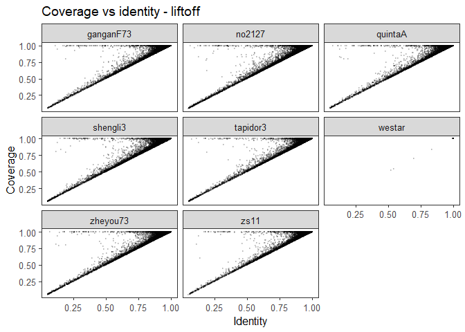
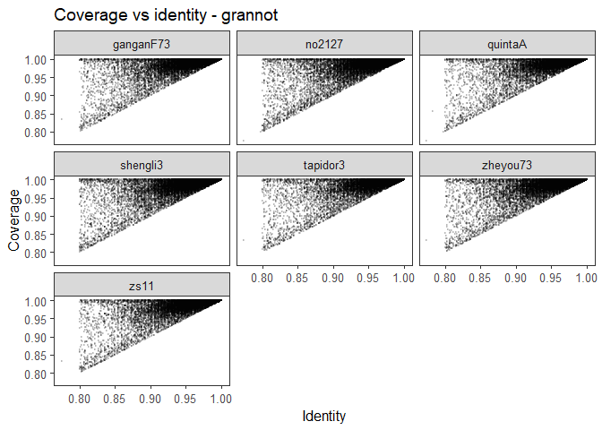

# Compare annotations

- [Load libraries](#load-libraries)
- [Load data](#load-data)
- [Summary output](#summary-output)

## Load libraries

``` r
library(stringr)
library(readr)
```

    Warning: package 'readr' was built under R version 4.3.3

``` r
library(dplyr)
```


    Attaching package: 'dplyr'

    The following objects are masked from 'package:stats':

        filter, lag

    The following objects are masked from 'package:base':

        intersect, setdiff, setequal, union

``` r
library(data.table)
```


    Attaching package: 'data.table'

    The following objects are masked from 'package:dplyr':

        between, first, last

``` r
library(ggplot2)
```

    Warning: package 'ggplot2' was built under R version 4.3.3

## Load data

``` r
parse_attrs_fast <- function(x, key) {
  out <- sub(
    paste0(".*(?:^|;)", key, "=([^;]+).*"),
    "\\1",
    x
  )

  out[!grepl(paste0("(?:^|;)", key, "="), x)] <- NA
  out
}

parse_one_gff <- function(file) {

  dt <- fread(
    cmd = paste("gzip -dc", shQuote(file), "| grep -v '^#'"),
    sep = "\t",
    header = FALSE,
    fill = TRUE,
    col.names = c(
      "seqid", "source", "feature", "start", "end",
      "score", "strand", "phase", "attrs"
    )
  )

  genes <- dt[feature == "gene", .(
    gene_ID = parse_attrs_fast(attrs, "ID"),
    gene_coverage = as.numeric(parse_attrs_fast(attrs, "coverage")),
    gene_identity = as.numeric(parse_attrs_fast(attrs, "sequence_ID"))
  )]

  mrnas <- dt[feature == "mRNA", .(
    file = basename(file),
    seqid,
    source,
    start,
    end,
    strand,
    mRNA_ID = parse_attrs_fast(attrs, "ID"),
    gene_ID = parse_attrs_fast(attrs, "Parent"),
    mRNA_coverage = as.numeric(parse_attrs_fast(attrs, "coverage")),
    mRNA_identity = as.numeric(parse_attrs_fast(attrs, "sequence_ID"))
  )]

  out <- merge(mrnas, genes, by = "gene_ID", all.x = TRUE)

  out[, coverage := fifelse(!is.na(mRNA_coverage), mRNA_coverage, gene_coverage)]
  out[, identity := fifelse(!is.na(mRNA_identity), mRNA_identity, gene_identity)]

  out[, .(
    file,
    seqid,
    source,
    start,
    end,
    strand,
    gene_ID,
    mRNA_ID,
    coverage,
    identity
  )]
}

gff_dir_liftoff <- "Data/liftoff"

gff_files_liftoff <- list.files(
  gff_dir_liftoff,
  pattern = "\\.gff3?\\.gz$",
  full.names = TRUE
)

result_liftoff <- rbindlist(
  lapply(gff_files_liftoff, parse_one_gff),
  use.names = TRUE,
  fill = TRUE
)

fwrite(result_liftoff, "mRNA_coverage_identity_liftoff.tsv.gz", sep = "\t")

gff_dir_grannot <- "Data/grannot"

gff_files_grannot <- list.files(
  gff_dir_grannot,
  pattern = "\\.gff?\\.gz$",
  full.names = TRUE
)

result_grannot <- rbindlist(
  lapply(gff_files_grannot, parse_one_gff),
  use.names = TRUE,
  fill = TRUE
)

fwrite(result_grannot, "mRNA_coverage_identity_grannot.tsv.gz", sep = "\t")
```

``` r
# -- liftoff
dt_liftoff <- fread("mRNA_coverage_identity_liftoff.tsv.gz")

dt_liftoff[, file := gsub("\\.genome\\.A10C9_orig\\.liftoff?\\.gff3?\\.gz$", "", file)]

plot_dt_liftoff <- dt_liftoff[
  ,
  .(
    file,
    mRNA_ID,
    coverage = as.numeric(coverage),
    identity = as.numeric(identity)
  )
][
  is.finite(coverage) & is.finite(identity)
]

p_scatter_liftoff <- ggplot(
  plot_dt_liftoff,
  aes(x = identity, y = coverage)
) +
  geom_point(
    alpha = 0.15,
    size = 0.4
  ) +
  facet_wrap(~file) +
  theme_bw(base_size = 12) +
  theme(
    panel.grid = element_blank()
  ) +
  labs(
    title = "Coverage vs identity - liftoff",
    x = "Identity",
    y = "Coverage"
  )

p_scatter_liftoff
```



``` r
stats_liftoff <- plot_dt_liftoff[
  ,
  .(
    n = .N,
    mean_coverage = mean(coverage),
    median_coverage = median(coverage),
    mean_identity = mean(identity),
    median_identity = median(identity)
  ),
  by = file
]

stats_liftoff
```

            file     n mean_coverage median_coverage mean_identity median_identity
    1: ganganF73 90075     0.9879196               1     0.9807068           1.000
    2:    no2127 86903     0.9828680               1     0.9731267           0.997
    3:   quintaA 90695     0.9888836               1     0.9824466           1.000
    4:  shengli3 87931     0.9840569               1     0.9749129           0.998
    5:  tapidor3 89737     0.9884606               1     0.9822111           1.000
    6:    westar 93604     0.9999850               1     0.9999849           1.000
    7:  zheyou73 88844     0.9853634               1     0.9769348           1.000
    8:      zs11 91659     0.9887646               1     0.9818344           1.000

``` r
# - grannot
dt_grannot <- fread("mRNA_coverage_identity_grannot.tsv.gz")

dt_grannot[, file := gsub("\\.gff?\\.gz$", "", file)]

plot_dt_grannot <- dt_grannot[
  ,
  .(
    file,
    mRNA_ID,
    coverage = as.numeric(coverage),
    identity = as.numeric(identity)
  )
][
  is.finite(coverage) & is.finite(identity)
]

p_scatter_grannot <- ggplot(
  plot_dt_grannot,
  aes(x = identity, y = coverage)
) +
  geom_point(
    alpha = 0.15,
    size = 0.4
  ) +
  facet_wrap(~file) +
  theme_bw(base_size = 12) +
  theme(
    panel.grid = element_blank()
  ) +
  labs(
    title = "Coverage vs identity - grannot",
    x = "Identity",
    y = "Coverage"
  )

p_scatter_grannot
```



``` r
stats_grannot <- plot_dt_grannot[
  ,
  .(
    n = .N,
    mean_coverage = mean(coverage),
    median_coverage = median(coverage),
    mean_identity = mean(identity),
    median_identity = median(identity)
  ),
  by = file
]

stats_grannot
```

            file     n mean_coverage median_coverage mean_identity median_identity
    1: ganganF73 77147     0.9960967               1     0.9876498           1.000
    2:    no2127 71765     0.9947661               1     0.9835845           0.998
    3:   quintaA 77199     0.9964934               1     0.9891209           1.000
    4:  shengli3 73532     0.9951142               1     0.9844739           0.999
    5:  tapidor3 76396     0.9965319               1     0.9892450           1.000
    6:  zheyou73 73033     0.9954471               1     0.9857287           1.000
    7:      zs11 78911     0.9960496               1     0.9877726           1.000

## Summary output

``` r
filter_transcripts <- function(dt, prefix, cov_cutoff = 0.80, id_cutoff = 0.80) {
  dt[, `:=`(
    coverage = as.numeric(coverage),
    identity = as.numeric(identity)
  )]

  kept_rows <- dt[coverage >= cov_cutoff & identity >= id_cutoff]
  removed_rows <- dt[coverage < cov_cutoff | identity < id_cutoff | is.na(coverage) | is.na(identity)]

  data.table(
    dataset = prefix,
    total_rows = nrow(dt),
    kept_rows = nrow(kept_rows),
    removed_rows = nrow(removed_rows),
    kept_genes = uniqueN(kept_rows$gene_ID),
    genes_with_removed_transcripts = uniqueN(removed_rows$gene_ID)
  )
}

stats_liftoff <- filter_transcripts(dt_liftoff, "liftoff")
stats_grannot <- filter_transcripts(dt_grannot, "grannot")

summarise_filter <- function(dt, dataset, cov_cutoff = 0.80, id_cutoff = 0.80) {
  dt <- copy(dt)
  dt[, `:=`(
    coverage = as.numeric(coverage),
    identity = as.numeric(identity)
  )]

  dt[, pass_80_80 := coverage >= cov_cutoff & identity >= id_cutoff]

  failed <- dt[
    !pass_80_80 | is.na(pass_80_80),
    .(
      dataset,
      file,
      seqid,
      source,
      start,
      end,
      strand,
      gene_ID,
      mRNA_ID,
      coverage,
      identity,
      fail_reason = fifelse(
        coverage < cov_cutoff & identity < id_cutoff,
        "coverage_and_identity",
        fifelse(
          coverage < cov_cutoff,
          "coverage",
          fifelse(identity < id_cutoff, "identity", "missing_value")
        )
      )
    )
  ][order(coverage, identity)]

  summary <- data.table(
    dataset = dataset,
    total_transcripts = nrow(dt),
    passing_transcripts = dt[pass_80_80 == TRUE, .N],
    failed_transcripts = nrow(failed),
    total_genes = uniqueN(dt$gene_ID),
    genes_with_passing_transcript = uniqueN(dt[pass_80_80 == TRUE, gene_ID]),
    genes_with_failed_transcript = uniqueN(failed$gene_ID),
    genes_only_failed = uniqueN(setdiff(
      unique(failed$gene_ID),
      unique(dt[pass_80_80 == TRUE, gene_ID])
    ))
  )

  list(summary = summary, failed = failed)
}

liftoff_qc <- summarise_filter(dt_liftoff, "liftoff")
grannot_qc <- summarise_filter(dt_grannot, "grannot")

qc_summary <- rbindlist(list(
  liftoff_qc$summary,
  grannot_qc$summary
))

qc_summary_wide <- melt(
  qc_summary,
  id.vars = "dataset",
  variable.name = "metric",
  value.name = "value"
)

qc_summary_wide <- dcast(
  qc_summary_wide,
  metric ~ dataset,
  value.var = "value"
)

qc_summary_wide
```

                              metric grannot liftoff
    1:             total_transcripts  527983  719448
    2:           passing_transcripts  527974  703071
    3:            failed_transcripts       9   16377
    4:                   total_genes   84421   91059
    5: genes_with_passing_transcript   84421   91057
    6:  genes_with_failed_transcript       2    7425
    7:             genes_only_failed       0       2
